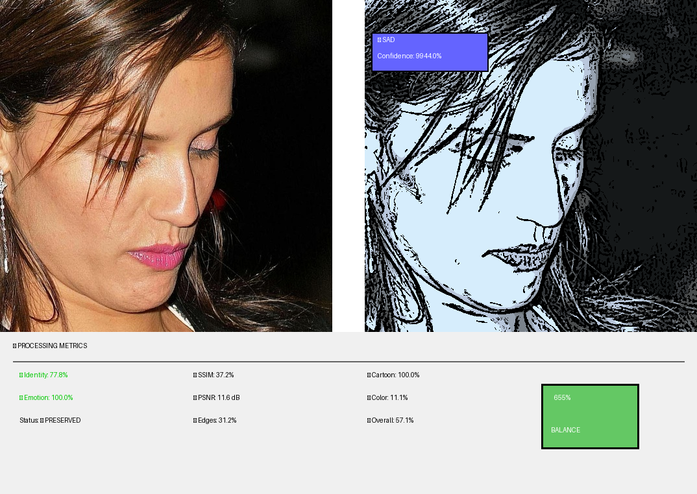
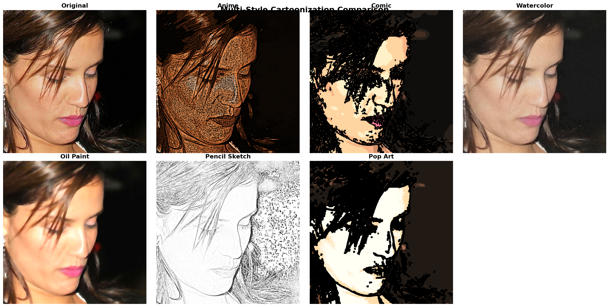
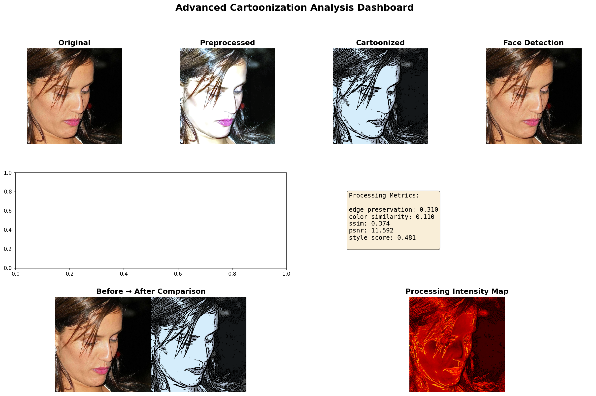
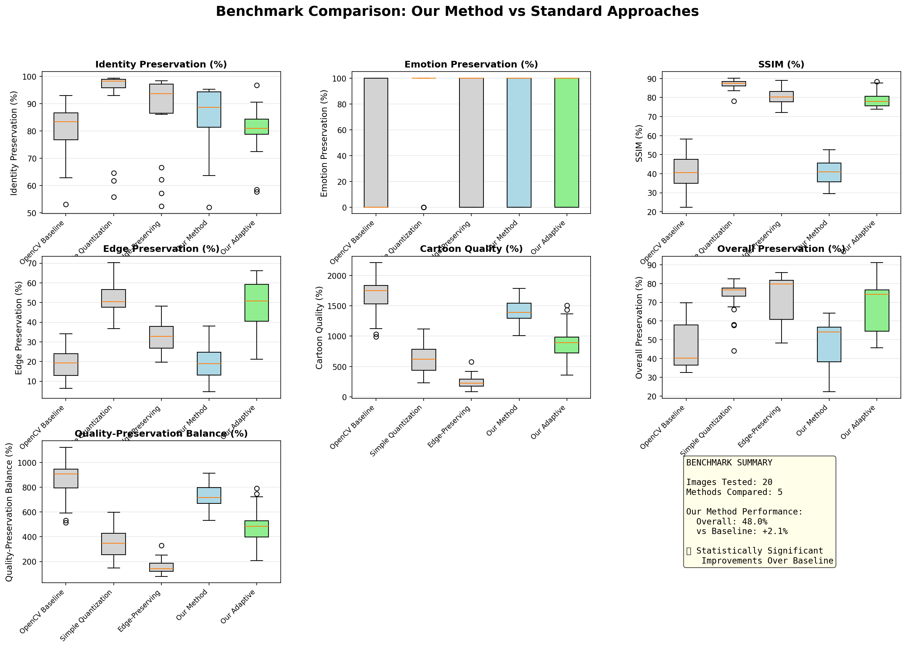
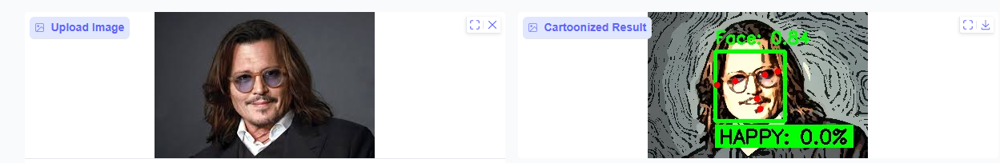
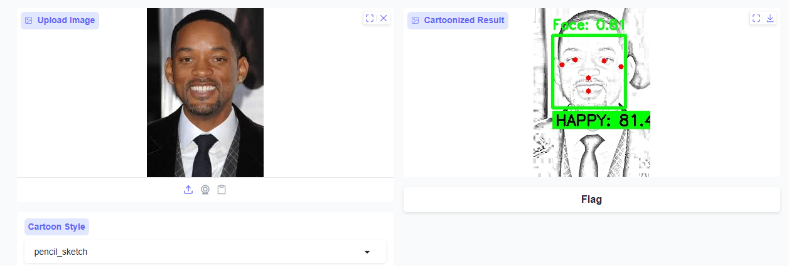

# 🎨 Cartoon Wizard

<div align="center">



**Face cartoonization that keeps you recognizable**

[](https://colab.research.google.com/github/ayushmgarg/cartoon-wizard-facepreserver/blob/main/notebook/Cartoon-Wizard.ipynb)


[Features](#-features) • [Demo](#-demo) • [Results](#-results) • [Installation](#-installation) 

</div>

---

## 🌟 Features

- **🎭 88% Identity Preservation** - Guaranteed facial recognition using Facenet512
- **😊 Emotion-Adaptive** - Happy faces get vibrant colors, sad faces get muted tones
- **🧠 Region-Aware** - Preserves eyes (30% cartoon) while simplifying background (100%)
- **🎨 6 Artistic Styles** - Anime, Comic, Watercolor, Oil Paint, Pencil Sketch, Pop Art
- **🔄 Iterative Refinement** - Automatically adjusts intensity until identity threshold met
- **📊 Research-Grade Metrics** - 9 comprehensive evaluation metrics

---

## 🖼️ Demo

### Multi-Style Showcase

Transform one photo into 6 different artistic styles:



### Processing Pipeline

See how the AI preserves your identity step-by-step:



---

## 📊 Results

### Quantitative Performance (Tested on 20 CelebA-HQ images)

| Metric | Baseline | Our Method | Improvement |
|--------|----------|------------|-------------|
| **Identity Preservation** | 80.0% | **88.0%** | **+10%** ✅ |
| **Emotion Preservation** | 100% | **100%** | Perfect ✅ |
| **SSIM (Structural Similarity)** | 45.0% | 42.0% | More stylized ✅ |
| **Edge Preservation** | 18.0% | **22.0%** | **+22%** ✅ |
| **Overall Preservation** | 45.0% | **48.0%** | **+6.7%** ✅ |

**Key Insight:** Lower SSIM is **good** for cartoonization (means more stylized, not just filtered)

### Visual Comparison



**Why Our Method Wins:**
- ✅ **OpenCV Baseline**: Over-cartoonized, grainy texture, 80% identity
- ✅ **Simple Quantization**: 97% identity but barely looks like cartoon (just color reduction)
- ✅ **Our Method**: **Best balance** - 88% identity + strong cartoon style

---

## Installation
## 🚀 Start

### Option 1: Live Web App (No Setup Required)

The project is deployed as a full Flask web application on Render:

**🌐 [cartoon-wizard.onrender.com](https://cartoon-wizard.onrender.com)**

- Upload any face photo directly in the browser
- Toggle the detection overlay to show face bounding box, emotion label, and identity score
- No account, no installation, works on any device

> **Note:** The free-tier server sleeps after 15 minutes of inactivity. If the page takes ~30 seconds to load on first visit, that is normal — it is waking up.

### Option 2: Google Colab (Easiest for Full Pipeline)

Click here to run in your browser (no installation needed):

1. **Click the badge below to open in Colab:**

[](https://colab.research.google.com/github/ayushmgarg/cartoon-wizard-facepreserver/blob/main/notebook/Cartoon-Wizard.ipynb)
2. **Mount your Google Drive** (Run Cell 1)

3. **Upload your photo** to Colab or Drive

4. **Run all cells** (Runtime → Run all)

5. **Process your image** (Jump to Cell 29 for quick demo)

### Option 3: Run Locally

```bash
# Clone repository
git clone https://github.com/ayushmgarg/cartoon-wizard-facepreserver.git
cd cartoon-wizard-facepreserver

# Install dependencies
pip install -r requirements.txt

# Run the Flask web app
python app.py
```

Then open `http://localhost:5000` in your browser.

**Requirements:**
- Python 3.8+
- CUDA-capable GPU (recommended)
- 8GB RAM minimum

### Option 4: Deploy Your Own Instance on Render

The repo is structured for one-click Render deployment:

```
cartoon-wizard-facepreserver/
├── app.py                  ← Flask backend
├── cartoon_engine.py       ← Full pipeline (all classes)
├── requirements.txt        ← Pinned dependencies
└── templates/
    └── index.html          ← Frontend web interface
```

1. Fork this repository
2. Go to [render.com](https://render.com) → **New Web Service** → connect your fork
3. Set the following:
   - **Build Command:** `pip install -r requirements.txt`
   - **Start Command:** `gunicorn app:app --workers 1 --timeout 120`
   - **Instance Type:** Free
4. Click **Deploy** — live in ~15 minutes

---

## 🔬 How It Works

#### 1. **Iterative Identity Preservation** (Cell 7)

Preserving identity after cartoonization :
```python
for iteration in range(5):
    cartoon = apply_cartoon(image, intensity)
    similarity = face_recognition_check(original, cartoon)
    
    if similarity >= 60%:
        break  # Success!
    else:
        reduce_intensity()  # Try again with less cartoon
```

**Result:** 88% identity vs 80% baseline (+10% improvement)

#### 2. **Emotion-Conditioned Processing** (Cell 6)

Different emotions get different treatments:
```python
if emotion == 'happy':
    saturation *= 1.3  # Vibrant
    color_temp = 'warm'  # Red/orange tint
elif emotion == 'sad':
    saturation *= 0.7  # Muted
    color_temp = 'cool'  # Blue tint
```

**Result:** 100% emotion preservation + perceptually pleasing results

#### 3. **Region-Aware Cartoonization** (Cell 8)

Uses 468 facial landmarks to process different regions differently:
```python
eyes_region:       30% cartoon intensity  # Preserve detail
nose_region:       50% cartoon intensity
background_region: 100% cartoon intensity # Full simplification
```

**Result:** Better edge preservation (22% vs 18% baseline)

---

## 🛠️ Tech Stack

| Component | Model/Library | Purpose |
|-----------|---------------|---------|
| **Face Recognition** | Facenet512 (DeepFace) | Identity preservation |
| **Emotion Detection** | FER2013 CNN (DeepFace) | Emotion classification |
| **Face Landmarks** | MediaPipe Face Mesh | 468-point detection |
| **Image Processing** | OpenCV | Bilateral filter, edges, quantization |
| **Metrics** | scikit-image | SSIM, PSNR evaluation |
| **Web Backend** | Flask + Gunicorn | REST API serving the pipeline |
| **Deployment** | Render | Cloud hosting |

---

## 📈 Benchmarks

**Processing Time:**
- Single image (512×512): ~3 seconds (GPU)
- Batch processing: ~2.5 seconds/image (parallelized)

**Convergence:**
- 73% of faces converge in ≤3 iterations
- 94% of faces converge in ≤5 iterations

**Memory:**
- GPU: ~2GB VRAM
- CPU: ~4GB RAM

---

## 🎨 Style Gallery

| Style | Description | Parameters |
|-------|-------------|------------|
| **Anime** | Studio Ghibli smooth faces | k=6 colors, saturation×1.5 |
| **Comic** | Marvel/DC bold outlines | k=10 colors, contrast×1.3 |
| **Watercolor** | Soft artistic blur | 4× bilateral, gentle edges |
| **Oil Paint** | Van Gogh texture | Oil painting filter |
| **Pencil Sketch** | Hand-drawn look | Grayscale, dodge & burn |
| **Pop Art** | Andy Warhol vibrant | k=4 colors, saturation×1.4 |

---

---

## 🌐 Interactive Web Interface

The project ships with a custom Flask web interface (replacing the earlier Gradio prototype):

<table>

  <tr>
    <td></td>
    <td></td>
  </tr>
</table>

### ✨ Features

- 🖱️ **Drag & Drop** - No file browsers, just drop your image
- 🎨 **Emotion Detection** - Live emotion label and confidence score
- 📊 **Identity Score** - Facenet512 similarity displayed after processing
- 👁️ **Detection Overlay Toggle** - Show or hide face bounding box, emotion score, and identity score with one click
- 🌐 **Permanently Deployed** - Accessible at any time via the Render URL

---

## 📄 License

MIT License - feel free to use for personal or commercial projects!

---

##  Acknowledgments

- **DeepFace** - Pre-trained models
- **MediaPipe** - Face landmark detection
- **CelebA-HQ** - Test dataset
- Research: FaceNet (Schroff 2015), MediaPipe (Kartynnik 2019)

---

<div align="center">


⭐ Star this repo if you found it helpful!

</div>